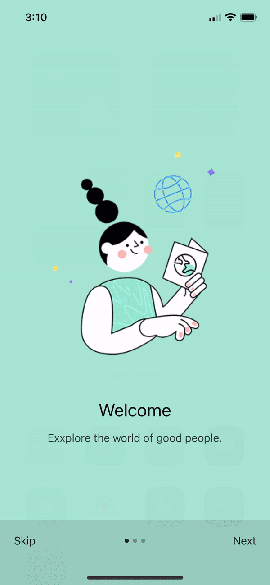
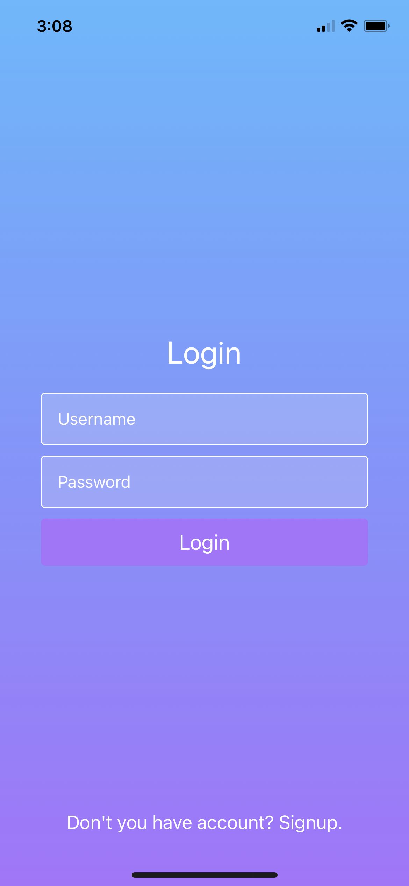

# iungo
is a latin name means connect, a social media app.
## building with react-native expo cli

## Welcome Launch

## Login Screen

## Signup Screen

## Camera Feature

## Home Screen

## Profile Screen

## Feel free to contribute
